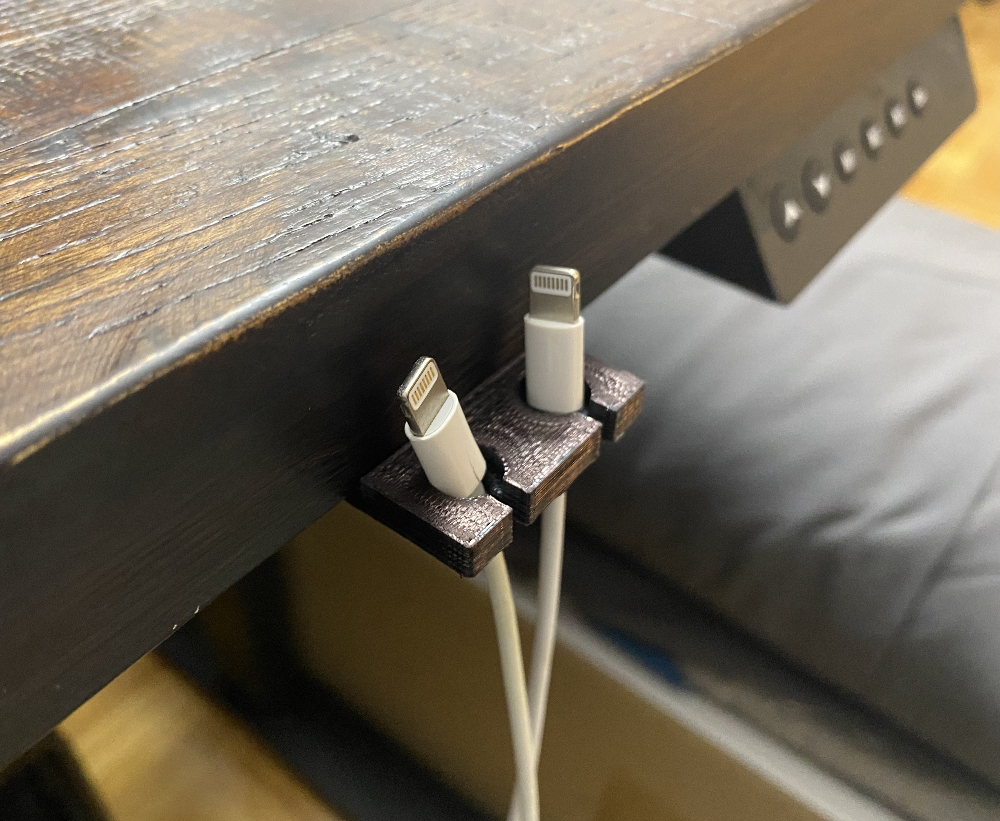

# 3D Printing - Lightning Cable Holder

## Description
This is a [OpenSCAD](https://openscad.org/) project that produces a 3D model for an apple lightning cablee holder. The stl file is used for 3D printing.

This project can be found on thingiverse:  
[thingiverse - lightning_cable_holder](https://www.thingiverse.com/thing:6297035)

## Instructions
For changing the design to have a different number of holes you will need [OpenSCAD](https://openscad.org/). Open the file named 'ligtning_cable_holder.scad' with OpenSCAD. On line 7, change the value of the variable named "number_of_holes". Export the new .stl file.

## Developer / Author
Jason Fleischer    
[https://jasonfleischer.github.io/website/](https://jasonfleischer.github.io/website/)  

Support the Developer  
[https://ko-fi.com/jasonfleischer](https://ko-fi.com/jasonfleischer)

## Images

